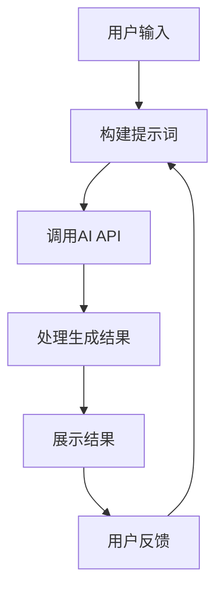
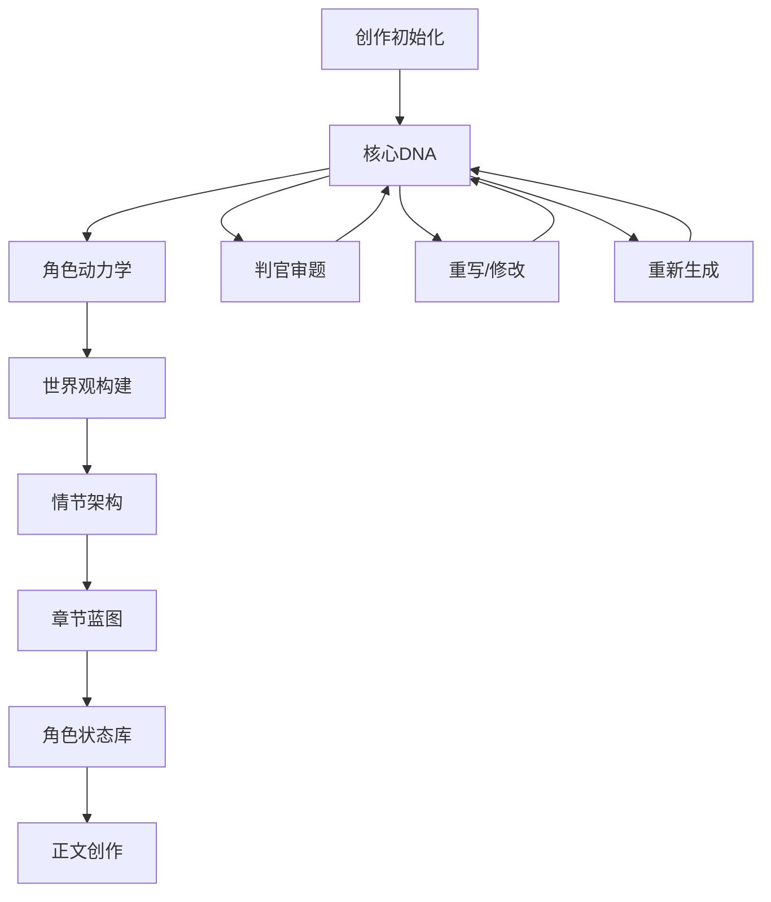

# AI小说创作助手 - 产品需求文档 (PRD)

## 1. 项目概述

### 1.1 项目背景
随着AI技术的快速发展，AI辅助创作已经成为文学创作领域的重要工具。本项目旨在打造一个功能完整、易用的AI小说创作助手，帮助作者从灵感初始化到正文创作的全流程中获得AI的辅助支持。

### 1.2 项目目标
- 提供一站式AI小说创作解决方案
- 支持从创意到完本的全流程辅助
- 实现AI与人类创作者的高效协作
- 降低小说创作的门槛，帮助更多人实现创作梦想

### 1.3 用户画像
- **小说作者**：需要AI辅助创作的职业或业余小说作者
- **写作爱好者**：对小说创作感兴趣，希望借助AI提高创作效率
- **编程学习者**：希望通过学习本项目了解AI编程的流程和实现

## 2. 核心功能模块

### 2.1 创作流程
本项目采用模块化的创作流程，包含以下8个核心步骤：

| 步骤 | 名称 | 功能描述 |
|------|------|----------|
| 1 | 创作初始化 | 收集基础创作信息，如核心脑洞、题材分类等 |
| 2 | 核心DNA | 生成小说的核心冲突和故事框架 |
| 3 | 角色动力学 | 设计具有深度的角色体系 |
| 4 | 世界观构建 | 创建小说的世界设定 |
| 5 | 情节架构 | 设计完整的情节结构 |
| 6 | 章节蓝图 | 规划每章的内容和悬念 |
| 7 | 角色状态库 | 跟踪角色状态变化 |
| 8 | 正文创作 | 生成小说正文内容 |

### 2.2 核心功能

#### 2.2.1 创作初始化
- **功能**：收集基础创作信息
- **输入**：核心脑洞、题材分类、故事基调、结局倾向、叙事视角等
- **输出**：基础设定

#### 2.2.2 核心DNA生成
- **功能**：生成小说的核心冲突和故事框架
- **输入**：基础设定
- **输出**：核心DNA（包含基础设定和核心冲突）
- **特殊功能**：
  - 判官审题：AI评审选题并提供优化方案
  - 重写/修改：基于最新核心DNA进行重写
  - 重新生成：重新生成核心DNA

#### 2.2.3 角色动力学
- **功能**：设计具有深度的角色体系
- **输入**：核心DNA
- **输出**：角色动力学设计（包含角色背景、动机、关系等）

#### 2.2.4 世界观构建
- **功能**：创建小说的世界设定
- **输入**：核心DNA、角色动力学
- **输出**：世界观设定（物理、社会、隐喻维度）

#### 2.2.5 情节架构
- **功能**：设计完整的情节结构
- **输入**：核心DNA、角色动力学、世界观
- **输出**：情节架构设计（基于选定的情节结构模型）

#### 2.2.6 章节蓝图
- **功能**：规划每章的内容和悬念
- **输入**：情节架构
- **输出**：章节蓝图（包含每章的定位、核心作用、悬念密度等）

#### 2.2.7 角色状态库
- **功能**：跟踪角色状态变化
- **输入**：角色动力学
- **输出**：角色状态档案
- **特殊功能**：上下文同步，更新角色状态

#### 2.2.8 正文创作
- **功能**：生成小说正文内容
- **输入**：核心DNA、角色状态、章节蓝图等
- **输出**：小说章节内容

## 3. 技术架构

### 3.1 技术栈

| 类别 | 技术 | 版本 |
|------|------|------|
| 前端框架 | React | ^19.2.1 |
| UI组件 | lucide-react | ^0.555.0 |
| 渲染引擎 | ReactMarkdown | ^10.1.0 |
| 构建工具 | Vite | ^6.2.0 |
| 样式框架 | TailwindCSS | ^4.1.17 |
| 语言 | TypeScript | ~5.8.2 |

### 3.2 架构设计

本项目采用前后端分离架构，前端负责用户交互和AI生成结果展示，后端（通过API调用）负责AI内容生成。

```
┌───────────────────────────────────────────────────────────┐
│                      用户界面                           │
├───────────────────────────────────────────────────────────┤
│                     业务逻辑层                           │
│  - 创作流程管理                                          │
│  - 提示词生成                                            │
│  - AI调用管理                                            │
│  - 数据状态管理                                          │
├───────────────────────────────────────────────────────────┤
│                     AI服务层                             │
│  - 调用外部AI API（Gemini/OpenAI等）                     │
│  - 提示词模板管理                                        │
└───────────────────────────────────────────────────────────┘
```

### 3.3 核心技术实现

#### 3.3.1 AI生成流程



#### 3.3.2 提示词设计

项目采用模板化的提示词设计，通过`PROMPTS`常量定义不同功能的提示词模板，支持自定义修改。

**示例提示词模板：**
```typescript
PROMPTS = {
  DNA: `# 小说核心DNA生成专家
  基于用户提供的创作设置，生成小说的核心DNA...
  ## 输入信息
  **基础设定：**
  - 小说名称：{novel_title}
  - 核心脑洞：{topic}
  ...
  `
}
```

## 4. 交互设计

### 4.1 界面流程



### 4.2 关键页面设计

#### 4.2.1 核心DNA页面

**功能**：展示和管理小说的核心DNA
**元素**：
- 判官审题按钮
- 重写/修改按钮
- 重新生成按钮
- 核心DNA展示区域

**交互流程**：
1. 用户点击判官审题按钮，AI生成评审结果
2. 用户选择优化方案，AI重写核心DNA
3. 用户可点击重写/修改按钮进行自定义修改
4. 用户可点击重新生成按钮重新生成核心DNA

## 5. 数据结构

### 5.1 核心数据模型

#### 5.1.1 用户输入数据 (`UserInputs`)

| 字段名 | 类型 | 描述 |
|--------|------|------|
| topic | string | 核心脑洞 |
| genre | string | 题材分类 |
| tone | string | 故事基调 |
| ending | string | 结局倾向 |
| perspective | string | 叙事视角 |
| numberOfChapters | number | 预计章节数 |
| wordCount | number | 每章字数 |
| customRequirements | string | 自定义特殊要求 |
| novelTitle | string | 小说名称 |

#### 5.1.2 生成数据 (`GeneratedData`)

| 字段名 | 类型 | 描述 |
|--------|------|------|
| dna | string/null | 核心DNA |
| globalSummary | string/null | 全局故事摘要 |
| characters | string/null | 角色动力学 |
| world | string/null | 世界观 |
| plot | string/null | 情节架构 |
| blueprint | string/null | 章节蓝图 |
| state | string/null | 角色状态 |
| chapters | Chapter[] | 章节列表 |
| stateHistory | StateArchive[] | 状态历史 |

#### 5.1.3 章节数据 (`Chapter`)

| 字段名 | 类型 | 描述 |
|--------|------|------|
| title | string | 章节标题 |
| content | string | 章节内容 |
| summary | string | 章节摘要 |
| role | string | 章节定位 |
| purpose | string | 核心作用 |

## 6. 非功能需求

### 6.1 性能需求
- AI生成响应时间 < 30秒
- 页面加载时间 < 2秒

### 6.2 安全性需求
- API密钥加密存储
- 防止恶意请求

### 6.3 可用性需求
- 界面简洁易用
- 错误提示友好

### 6.4 可扩展性需求
- 支持多种AI模型
- 支持自定义提示词模板

## 7. 开发计划

### 7.1 迭代计划

| 迭代 | 功能 | 周期 |
|------|------|------|
| V1.0 | 创作初始化、核心DNA生成、判官审题 | 2周 |
| V1.1 | 角色动力学、世界观构建 | 2周 |
| V1.2 | 情节架构、章节蓝图 | 2周 |
| V1.3 | 角色状态库、正文创作 | 2周 |
| V1.4 | 优化界面、修复bug | 1周 |

### 7.2 里程碑
- V1.0 发布：实现核心功能，支持从创意到核心DNA的生成
- V1.4 发布：完成所有功能，支持完整的小说创作流程

## 8. 学习指南

### 8.1 编程小白学习路径

1. **基础学习**：
   - 学习HTML、CSS、JavaScript基础
   - 学习React框架基础
   - 了解TypeScript基础

2. **项目学习**：
   - 克隆项目到本地
   - 安装依赖：`npm install`
   - 启动开发服务器：`npm run dev`
   - 查看项目结构，理解各文件的作用

3. **AI编程学习**：
   - 研究`PROMPTS`常量，了解提示词设计
   - 学习`generateContent`函数，了解AI API调用
   - 研究`handleGenerateStep`函数，了解AI生成流程
   - 尝试修改提示词模板，观察生成结果变化

4. **实践项目**：
   - 为项目添加新功能，如AI润色、风格转换等
   - 尝试接入其他AI模型
   - 优化提示词设计，提高生成质量

### 8.2 核心代码文件解析

| 文件 | 作用 | 学习重点 |
|------|------|----------|
| App.tsx | 主应用组件 | 创作流程管理、AI生成调用 |
| constants.ts | 常量定义 | 提示词模板设计 |
| types.ts | 类型定义 | 数据结构设计 |
| services/apiService.ts | API服务 | AI调用逻辑 |
| components/Modals.tsx | 模态框组件 | 交互设计 |

### 8.3 常见问题

1. **如何修改AI模型？**
   - 在`App.tsx`中修改`apiConfig`状态
   - 支持Google Gemini、OpenAI、DeepSeek等

2. **如何自定义提示词？**
   - 在`constants.ts`中修改`PROMPTS`常量
   - 或通过界面上的"编辑提示词"功能修改

3. **如何扩展新功能？**
   - 在`STEPS`数组中添加新步骤
   - 定义对应的提示词模板
   - 实现生成逻辑

## 9. 总结

本项目是一个功能完整、架构清晰的AI小说创作助手，适合编程小白学习AI编程和Web开发。通过学习本项目，你可以了解：

- React + TypeScript的前端开发
- AI生成内容的完整流程
- 提示词设计的最佳实践
- 模块化的代码组织结构
- 前后端分离的架构设计

希望这份PRD文档能帮助你更好地理解项目，并开始你的AI编程学习之旅！