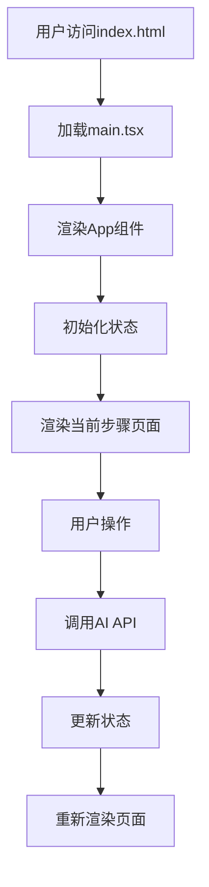
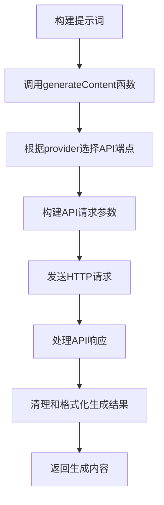

# AI小说创作助手 - 技术文档

## 1. 项目概述

### 1.1 项目简介
本项目是一个基于React + TypeScript开发的AI小说创作助手，支持从灵感初始化到正文创作的全流程AI辅助。通过调用外部AI API，实现了核心DNA生成、角色设计、世界观构建等功能。

### 1.2 技术栈
| 类别 | 技术 | 版本 |
|------|------|------|
| 前端框架 | React | ^19.2.1 |
| 语言 | TypeScript | ~5.8.2 |
| 构建工具 | Vite | ^6.2.0 |
| UI组件 | lucide-react | ^0.555.0 |
| Markdown渲染 | ReactMarkdown | ^10.1.0 |
| 样式框架 | TailwindCSS | ^4.1.17 |
| API调用 | 自定义实现 | - |

## 2. 文件结构

```
deepstory-04/
├── src/
│   ├── components/          # UI组件
│   │   ├── StepCard.tsx     # 步骤卡片组件
│   │   ├── MarkdownViewer.tsx  # Markdown渲染组件
│   │   ├── WritingStep.tsx  # 正文创作步骤组件
│   │   └── Modals.tsx       # 模态框组件
│   ├── services/            # 服务层
│   │   └── apiService.ts    # API调用服务
│   ├── App.tsx              # 主应用组件
│   ├── constants.ts         # 常量定义
│   ├── types.ts             # 类型定义
│   ├── main.tsx             # 应用入口
│   └── index.css            # 全局样式
├── index.html               # HTML入口文件
├── package.json             # 项目配置和依赖
├── vite.config.ts           # Vite配置
├── tailwind.config.js       # TailwindCSS配置
├── postcss.config.js        # PostCSS配置
└── tsconfig.json            # TypeScript配置
```

### 2.1 核心文件说明

| 文件 | 主要功能 |
|------|----------|
| App.tsx | 主应用组件，管理创作流程和状态 |
| constants.ts | 定义提示词模板、标签、故事基调等常量 |
| types.ts | 定义数据类型和接口 |
| services/apiService.ts | 实现AI API调用逻辑 |
| components/Modals.tsx | 实现各种模态框，如判官审题结果、自定义请求等 |
| components/MarkdownViewer.tsx | 渲染Markdown格式的AI生成结果 |

## 3. 运行逻辑

### 3.1 应用启动流程



### 3.2 创作流程实现

创作流程包含8个核心步骤，通过`STEPS`常量定义：

```typescript
const STEPS: StepDefinition[] = [
    { id: 'init', title: '创作初始化', icon: BookOpen },
    { id: 'dna', title: '核心 DNA', icon: Activity, promptKey: 'DNA' },
    { id: 'characters', title: '角色动力学', icon: Users, promptKey: 'CHARACTERS' },
    { id: 'world', title: '世界观构建', icon: Globe, promptKey: 'WORLD' },
    { id: 'plot', title: '情节架构', icon: GitMerge, promptKey: 'PLOT' },
    { id: 'blueprint', title: '章节蓝图', icon: List, promptKey: 'BLUEPRINT' },
    { id: 'state', title: '角色状态库', icon: Activity, promptKey: 'STATE_INIT' },
    { id: 'writing', title: '正文创作', icon: PenTool, promptKey: 'CHAPTER_1' }
];
```

### 3.3 核心DNA生成逻辑

```mermaid
flowchart TD
    A[用户点击"生成核心架构"] --> B[调用handleGenerateStep函数]
    B --> C[构建提示词变量]
    C --> D[调用formatPrompt函数格式化提示词]
    D --> E[调用generateContent函数调用AI API]
    E --> F[处理AI生成结果]
    F --> G[更新generatedData.dna状态]
    G --> H[重新渲染页面，展示生成结果]
```

### 3.4 判官审题功能逻辑

```mermaid
flowchart TD
    A[用户点击"判官审题"] --> B[调用handleJudge函数]
    B --> C[构建用户提示词]
    C --> D[调用generateContent函数生成评审结果]
    D --> E[更新judgeResult状态]
    E --> F[显示JudgeResultModal模态框]
    F --> G[用户选择优化方案]
    G --> H[调用handleSelectJudgeProposal函数]
    H --> I[提取选中方案]
    I --> J[构建DNA生成提示词]
    J --> K[调用generateContent函数生成新DNA]
    K --> L[更新generatedData.dna状态]
    L --> M[关闭模态框，重新渲染页面]
```

### 3.5 重写/修改功能逻辑

```mermaid
flowchart TD
    A[用户点击"重写/修改"] --> B[调用openCustomModal函数]
    B --> C[显示CustomRequestModal模态框]
    C --> D[用户输入自定义修改要求]
    D --> E[调用handleGenerateStep函数]
    E --> F[构建包含自定义要求的提示词]
    F --> G[调用AI API生成新结果]
    G --> H[更新generatedData状态]
    H --> I[关闭模态框，重新渲染页面]
```

## 4. 数据结构

### 4.1 核心类型定义

#### 4.1.1 UserInputs - 用户输入数据
```typescript
export interface UserInputs {
  topic: string;           // 核心脑洞
  genre: string;           // 题材分类
  tone: string;            // 故事基调
  ending: string;          // 结局倾向
  perspective: string;     // 叙事视角
  numberOfChapters: number; // 预计章节数
  wordCount: number;       // 每章字数
  customRequirements: string; // 自定义特殊要求
  novelTitle: string;      // 小说名称
}
```

#### 4.1.2 GeneratedData - 生成的数据
```typescript
export interface GeneratedData {
  dna: string | null;               // 核心DNA
  globalSummary: string | null;      // 全局故事摘要
  characters: string | null;         // 角色动力学
  world: string | null;             // 世界观构建
  plot: string | null;              // 情节架构
  blueprint: string | null;         // 章节蓝图
  state: string | null;             // 角色状态库
  chapters: Chapter[];             // 章节列表
  stateHistory?: StateArchive[];    // 状态历史
}
```

#### 4.1.3 Chapter - 章节数据
```typescript
export interface Chapter {
  title: string;           // 章节标题
  content: string;         // 章节内容
  summary?: string;        // 章节摘要
  role?: string;           // 章节定位
  purpose?: string;        // 核心作用
  suspense?: string;       // 悬念密度
  twist?: string;          // 认知颠覆
}
```

#### 4.1.4 ApiConfig - API配置
```typescript
export interface ApiConfig {
  provider: 'google' | 'openai' | 'claude' | 'deepseek' | 'custom'; // AI提供商
  baseUrl: string;        // API基础URL
  apiKey: string;         // API密钥
  textModel: string;      // 文本生成模型
  customTextModel?: string; // 自定义模型
}
```

#### 4.1.5 StepDefinition - 步骤定义
```typescript
export interface StepDefinition {
  id: keyof GeneratedData | 'init' | 'writing'; // 步骤ID
  title: string;           // 步骤标题
  icon: any;               // 步骤图标
  promptKey?: string;       // 对应的提示词模板键
}
```

#### 4.1.6 StateArchive - 状态档案
```typescript
export interface StateArchive {
  chapterNum: number;      // 章节号
  title: string;           // 存档标题
  globalSummary: string;    // 全局摘要
  characterState: string;   // 角色状态
  chapterSummary: string;   // 章节摘要
  timestamp: number;        // 存档时间戳
}
```

## 5. 状态管理

### 5.1 核心状态变量

| 状态变量 | 类型 | 初始值 | 功能描述 |
|----------|------|--------|----------|
| currentStep | number | 0 | 当前步骤索引 |
| inputs | UserInputs | 空对象 | 用户输入的基础创作信息 |
| apiConfig | ApiConfig | 默认配置 | API配置信息 |
| generatedData | GeneratedData | 初始值 | AI生成的数据 |
| customPrompts | Record<string, string> | {} | 用户自定义的提示词模板 |
| isGenerating | boolean | false | 是否正在生成内容 |
| isJudging | boolean | false | 是否正在进行判官审题 |
| isSyncingContext | boolean | false | 是否正在同步上下文 |
| loadingMessage | string | "" | 加载提示信息 |
| judgeResult | string | "" | 判官审题的结果 |
| showJudgeModal | boolean | false | 是否显示判官结果模态框 |

### 5.2 状态更新逻辑

1. **用户输入更新**：通过`setInputs`函数更新用户输入数据
2. **生成数据更新**：通过`setGeneratedData`函数更新AI生成的数据
3. **步骤切换**：通过`setCurrentStep`函数切换创作步骤
4. **加载状态更新**：通过`setIsGenerating`等函数更新加载状态
5. **模态框状态更新**：通过`setShowJudgeModal`等函数控制模态框显示/隐藏

## 6. 常量定义

### 6.1 核心常量

#### 6.1.1 PROMPTS - 提示词模板
```typescript
export const PROMPTS = {
  JUDGE: `# 网文选题·生死判官...`,
  DNA: `# 小说核心DNA生成专家...`,
  CHARACTERS: `# 角色动力学架构专家...`,
  WORLD: `# 三维世界构建专家...`,
  PLOT: `# 情节架构师...`,
  BLUEPRINT: `# 章节悬念节奏设计师...`,
  STATE_INIT: `# 角色状态管理专家...`,
  STATE_UPDATE: `# 小说上下文同步与状态更新专家...`,
  CHAPTER_1: `# 首章内容创作专家...`,
  CHAPTER_NEXT: `# 后续章节创作专家...`
};
```

#### 6.1.2 其他常量

| 常量 | 类型 | 功能描述 |
|------|------|----------|
| TAGS | 对象 | 题材标签，分为男频和女频 |
| STORY_TONES | 数组 | 故事基调选项 |
| ENDING_TYPES | 数组 | 结局倾向选项 |
| NARRATIVE_PERSPECTIVES | 数组 | 叙事视角选项 |
| PLOT_STRUCTURES | 数组 | 情节结构选项 |

## 7. API服务

### 7.1 apiService.ts 核心函数

#### 7.1.1 generateContent - AI内容生成
```typescript
export const generateContent = async (
  systemPrompt: string,
  userPrompt: string,
  config: ApiConfig
): Promise<string> => {
  // 根据不同的AI提供商调用不同的API
  // 处理API响应，返回生成的内容
};
```

**参数说明**：
- `systemPrompt`：系统提示词，定义AI的角色和任务
- `userPrompt`：用户提示词，提供具体的创作要求
- `config`：API配置信息

**返回值**：AI生成的内容字符串

#### 7.1.2 formatPrompt - 提示词格式化
```typescript
export const formatPrompt = (template: string, variables: Record<string, any>): string => {
  // 将模板中的变量替换为实际值
  // 返回格式化后的提示词
};
```

**参数说明**：
- `template`：提示词模板，包含{variable}形式的占位符
- `variables`：变量对象，键为占位符名称，值为替换内容

**返回值**：格式化后的完整提示词

## 8. 核心功能实现

### 8.1 核心DNA生成

**实现函数**：`handleGenerateStep`
**功能**：根据当前步骤生成对应的AI内容
**核心逻辑**：
1. 获取当前步骤的提示词模板
2. 构建提示词变量，包含用户输入和已生成的数据
3. 格式化提示词
4. 调用AI API生成内容
5. 更新生成的数据状态

**关键代码**：
```typescript
const handleGenerateStep = async (stepId: keyof GeneratedData, customReq: string = "") => {
  // ...
  const template = customPrompts[stepDef.promptKey] || PROMPTS[stepDef.promptKey as keyof typeof PROMPTS];
  const variables = {
    novel_title: String(inputs.novelTitle || "未命名"),
    topic: String(inputs.topic || ""),
    // ... 其他变量
    STORY_DNA: String(generatedData.dna || "暂无核心DNA"),
    // ... 其他生成数据
  };
  const prompt = formatPrompt(template, variables);
  const result = await generateContent(prompt, "开始生成任务", apiConfig);
  setGeneratedData(prev => ({
    ...prev,
    [stepId]: result
  }));
  // ...
};
```

### 8.2 判官审题

**实现函数**：`handleJudge`和`handleSelectJudgeProposal`
**功能**：生成评审结果并根据选择的方案重写核心DNA
**核心逻辑**：
1. 构建包含当前创作信息的用户提示词
2. 调用AI API生成评审结果
3. 显示评审结果模态框
4. 用户选择优化方案
5. 提取选中方案
6. 构建新的DNA生成提示词
7. 调用AI API生成新DNA
8. 更新核心DNA状态

**关键代码**：
```typescript
const handleJudge = async () => {
  // ...
  let userPrompt = `题材：${inputs.genre}\n核心脑洞：${inputs.topic}\n`;
  // ... 添加其他创作信息
  const result = await generateContent(template, userPrompt, apiConfig);
  setJudgeResult(result);
  setShowJudgeModal(true);
  // ...
};

const handleSelectJudgeProposal = async (proposalIndex: number) => {
  // ...
  const selectedProposal = extractSelectedProposal(judgeResult, proposalIndex);
  const variables = {
    // ... 基础创作信息
    custom_instruction: `严格根据判官评审方案${proposalIndex}重写核心DNA...`,
    // ... 其他变量
  };
  const prompt = formatPrompt(template, variables);
  const newContent = await generateContent(prompt, "开始生成任务", apiConfig);
  // ... 处理生成结果
  setGeneratedData(prev => ({ ...prev, dna: cleanedContent }));
  // ...
};
```

### 8.3 重写/修改功能

**实现函数**：`openCustomModal`和`handleGenerateStep`
**功能**：允许用户输入自定义修改要求，重新生成内容
**核心逻辑**：
1. 打开自定义请求模态框
2. 用户输入自定义修改要求
3. 调用`handleGenerateStep`函数，传入自定义修改要求
4. 构建包含自定义要求的提示词
5. 调用AI API生成新内容
6. 更新生成的数据状态

**关键代码**：
```typescript
const openCustomModal = (title: string, callback: (val: string) => void) => {
  // ... 显示模态框
};

// 重写/修改按钮点击事件
onClick={() => openCustomModal(STEPS[currentStep].title, (val) => handleGenerateStep(currentStepId, val))}
```

## 9. 组件通信

### 9.1 组件层级结构

```
App
├── StepCard (多个)
├── MarkdownViewer
├── WritingStep
├── PromptEditorModal
├── CustomRequestModal
├── JudgeResultModal
├── ConfigModal
├── PromptManagerModal
└── PlotStructureModal
```

### 9.2 组件通信方式

1. **Props传递**：父组件通过props向子组件传递数据和回调函数
2. **状态提升**：将共享状态提升到最近的公共父组件
3. **Ref引用**：使用useRef保存回调函数，确保同步更新
4. **事件回调**：通过回调函数实现子组件向父组件通信

## 10. 核心API调用

### 10.1 AI API调用流程



### 10.2 API请求参数

| 参数 | 类型 | 功能描述 |
|------|------|----------|
| system | string | 系统提示词 |
| messages | array | 消息数组，包含用户和AI的对话历史 |
| temperature | number | 生成内容的随机性，范围0-1 |
| max_tokens | number | 生成内容的最大长度 |
| model | string | 使用的AI模型名称 |

## 11. 性能优化

### 11.1 优化措施

1. **异步加载**：AI生成过程使用异步函数，不阻塞主线程
2. **状态管理优化**：合理使用React状态，避免不必要的重渲染
3. **组件拆分**：将复杂组件拆分为简单组件，提高复用性和性能
4. **代码分割**：使用Vite的代码分割功能，减小初始加载体积
5. **缓存机制**：缓存API调用结果，避免重复调用

### 11.2 加载状态管理

通过`isGenerating`、`isJudging`、`isSyncingContext`等状态变量管理加载状态，显示相应的加载提示，提升用户体验。

## 12. 开发和构建

### 12.1 开发命令

| 命令 | 功能 |
|------|------|
| `npm install` | 安装依赖 |
| `npm run dev` | 启动开发服务器 |
| `npm run build` | 构建生产版本 |
| `npm run preview` | 预览生产版本 |

### 12.2 构建流程

1. 清理旧的构建文件
2. 转换TypeScript代码为JavaScript
3. 打包和压缩代码
4. 生成dist目录，包含可部署的静态文件
5. 生成index.html文件，引入打包后的JavaScript文件

## 13. 核心功能的输入输出示例

### 13.1 核心DNA生成

**输入**：
```
{ 
  topic: "修仙世界卖保险",
  genre: "都市修真",
  tone: "爆笑",
  // ... 其他输入
}
```

**输出**：
```markdown
## 基础设定 (BASIC_SETTINGS)
- 小说名称：修仙保险推销员
- 核心脑洞：修仙世界卖保险
- 题材分类：都市修真
- 叙事视角：第三人称限制
- 故事基调：爆笑
- 结局倾向：圆满
- 预计章节数：12章
- 每章字数：2000字
- 自定义特殊要求：主角必须靠理赔来提升修为

## 核心DNA (STORY_DNA)
当一个普通的保险推销员穿越到修仙世界，发现自己只能通过卖保险和处理理赔来提升修为时，他必须在这个充满危险和机遇的世界中，利用自己的保险知识和商业头脑，建立起修仙界的保险帝国，同时应对各种奇葩的理赔请求和来自修真者的挑战；否则，他将永远无法提升修为，甚至可能在这个危险的世界中丧命；与此同时，一个隐藏在修仙界背后的巨大阴谋正在慢慢浮出水面，与保险行业有着千丝万缕的联系。
```

### 13.2 判官审题

**输入**：
```
{ 
  topic: "修仙世界卖保险",
  genre: "都市修真",
  // ... 其他输入
  dna: "## 核心DNA (STORY_DNA) 当一个普通的保险推销员..."
}
```

**输出**：
```markdown
【市场定级】：S+ 原创性评分：9分
【套路粉碎机】：...
【原创S级魔改】
【方案1：逻辑反转】
1. **创新手法**：将"主角卖保险给修真者"反转成"修真者求主角卖保险给他"
2. **核心DNA重写建议**：当一个拥有"因果律保险"能力的推销员...
```

## 14. 学习指南

### 14.1 代码学习路径

1. **先学基础文件**：
   - `types.ts`：了解数据结构
   - `constants.ts`：了解提示词设计
   - `services/apiService.ts`：了解AI API调用

2. **再学核心组件**：
   - `App.tsx`：了解应用的整体结构和核心逻辑
   - `components/Modals.tsx`：了解模态框的实现
   - `components/MarkdownViewer.tsx`：了解Markdown渲染

3. **最后学功能实现**：
   - 核心DNA生成：`handleGenerateStep`函数
   - 判官审题：`handleJudge`和`handleSelectJudgeProposal`函数
   - 重写/修改：`openCustomModal`函数

### 14.2 常见问题解答

1. **如何修改AI模型？**
   - 在应用中点击右下角的设置图标
   - 修改API配置中的provider和model
   - 保存配置

2. **如何自定义提示词？**
   - 在每个步骤页面点击编辑提示词图标
   - 修改提示词模板
   - 保存修改

3. **如何扩展新功能？**
   - 在`STEPS`数组中添加新的步骤定义
   - 在`PROMPTS`中添加对应的提示词模板
   - 实现新的生成逻辑

## 15. 总结

本项目是一个功能完整、架构清晰的AI小说创作助手，通过React + TypeScript实现了从灵感初始化到正文创作的全流程AI辅助。项目采用模块化设计，便于扩展和维护。

核心亮点：
1. 支持完整的小说创作流程
2. 灵活的提示词模板系统
3. 支持多种AI模型
4. 友好的用户界面和交互体验
5. 清晰的代码结构和详细的文档

通过学习本项目，你可以了解AI编程的核心概念，包括提示词设计、API调用、状态管理等。同时，你也可以学习React + TypeScript的开发流程和最佳实践。

祝你学习愉快，早日成为AI编程高手！
